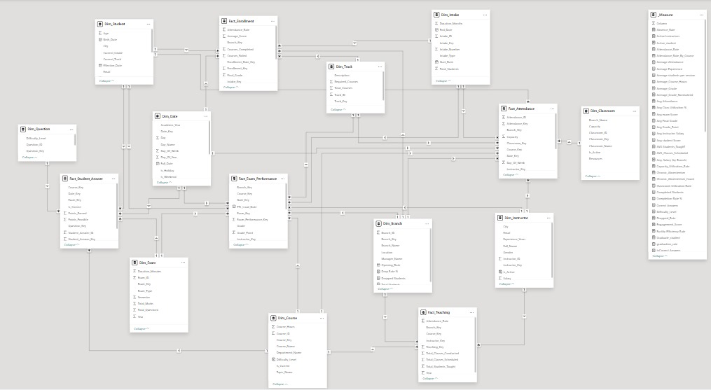

# Entity Relationship Diagram (ERD)

## Database Schema Overview

### Core Tables

#### Person (Parent Table)
- **P_ID** (PK): Person identifier
- **F_name**: First name
- **L_name**: Last name
- **Email**: Email address (unique)
- **Password**: Hashed password (bcrypt)
- **City**: City of residence
- **Street**: Street address
- **Age**: Age

#### Student (Inherits from Person)
- **S_ID** (PK, FK): References Person.P_ID
- **Dept_ID** (FK): References Department
- **Graduation**: Graduation date (nullable)

#### Instructor (Inherits from Person)
- **Ins_ID** (PK, FK): References Person.P_ID
- **Dept_ID** (FK): References Department
- **Salary**: Instructor salary

#### Manager (Inherits from Person)
- **Manager_ID** (PK, FK): References Person.P_ID

### Course and Exam Tables

#### Course
- **Course_ID** (PK): Course identifier
- **Course_name**: Course name
- **Duration**: Duration in hours

#### Exam
- **Exam_ID** (PK): Exam identifier
- **Course_ID** (FK): References Course
- **Ins_ID** (FK): References Instructor
- **Start_Time**: Exam start datetime
- **End_Time**: Exam end datetime
- **year**: Academic year
- **Semester**: Semester (1 or 2)

### Question Bank

#### Question
- **Question_ID** (PK): Question identifier
- **Question_text**: Question content
- **Course_ID** (FK): References Course
- **Correct_answer**: Correct answer option (A/B/C/D)

#### Choice
- **Question_ID** (FK): References Question
- **Choice_text**: Choice content
- **Is_correct**: Boolean flag

### Results and Attendance

#### Student_Exam
- **S_ID** (FK): References Student
- **Exam_ID** (FK): References Exam
- **grade**: Exam grade (0-100)
- **exam_date**: Date taken

#### Attendance (Optional)
- **Attendance_ID** (PK): Attendance record ID
- **S_ID** (FK): References Student
- **Course_ID** (FK): References Course
- **Date**: Attendance date
- **Status**: Present/Absent/Late

## ERD Diagram

## Relationships

- Person → Student/Instructor/Manager (1:1)
- Department → Students/Instructors (1:N)
- Course → Exams (1:N)
- Course → Questions (1:N)
- Instructor → Exams (1:N)
- Student → Student_Exam (1:N)
- Exam → Student_Exam (1:N)
- Question → Choices (1:4)

## Data Integrity

- All foreign keys have ON DELETE CASCADE or RESTRICT
- Passwords stored with bcrypt hashing
- Email addresses are unique
- Grade constraints: 0-100
